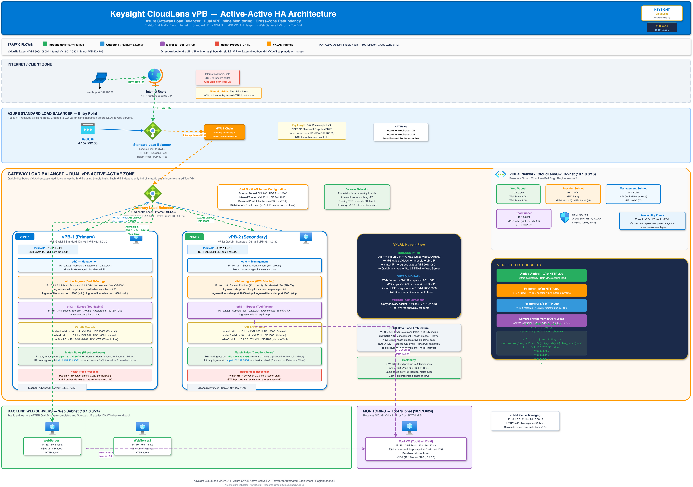

# CloudLens vPB Active-Active HA on Azure Gateway Load Balancer

Terraform-automated deployment of **dual Keysight CloudLens Virtual Packet Brokers (vPB)** behind an **Azure Gateway Load Balancer (GWLB)** for inline network visibility with cross-zone fault tolerance.

## Architecture



> **Editable source:** [`docs/cloudlens-vpb-gwlb-ha-architecture.drawio`](docs/cloudlens-vpb-gwlb-ha-architecture.drawio) — open with [draw.io Desktop](https://github.com/jgraph/drawio-desktop/releases) or [app.diagrams.net](https://app.diagrams.net)

**Traffic Flow:** Internet → Standard LB → GWLB → vPB VXLAN hairpin → Web Servers (both directions mirrored to Tool VM)

## Prerequisites

| Requirement | Details |
|---|---|
| Azure CLI | `az login` authenticated |
| Terraform | v1.9.5+ |
| Azure Subscription | With permissions to create VMs, LBs, VNets |
| vPB Installer | `vpb-3.14.0-30-install-package.sh` from [Keysight Support Portal](https://support.ixiacom.com) |
| vLM VHD | `CloudLens-vLM-1.7.vhd` from [Keysight Support Portal](https://support.ixiacom.com) |
| vPB License | Advanced license (obtain from Keysight) |

## Quick Start

### Step 1: Clone and Configure

```bash
git clone https://github.com/Keysight-Tech/cloudlens-vpb-azure-gwlb.git
cd cloudlens-vpb-azure-gwlb

# Create your variables file
cp terraform.tfvars.example terraform.tfvars
```

Edit `terraform.tfvars` with your values:

```hcl
subscription_id    = "your-azure-subscription-id"
admin_password     = "YourSecurePassword123!"
vpb_admin_password = "YourVPBPassword123!"
vpb_cli_password   = "ixia"
vpb_installer_path = "/path/to/vpb-3.14.0-30-install-package.sh"
vlm_vhd_path       = "/path/to/CloudLens-vLM-1.7.vhd"
```

### Step 2: Deploy

```bash
az login
terraform init
terraform plan
terraform apply
```

Deployment takes approximately **30-45 minutes** (vPB installer is large).

### Step 3: Verify

After `terraform apply` completes, note the outputs:

```bash
terraform output
```

Test end-to-end:

```bash
# Test HTTP through the full chain
curl http://$(terraform output -raw load_balancer_ip)

# Verify mirror traffic on Tool VM
ssh azureuser@$(terraform output -raw tool_vm_public_ip) \
  "sudo tcpdump -c 10 -i eth0 udp port 4789"
```

## Deployed Resources

| Resource | Subnet | Purpose |
|---|---|---|
| Standard Load Balancer | Public IP | Entry point for HTTP traffic, chained to GWLB |
| Gateway Load Balancer | ProviderBackendNet (10.1.1.0/24) | VXLAN tunnel manager for inline inspection |
| vPB-1 (Zone 1) | Mgmt: 10.1.2.0/24, Ingress: 10.1.1.5, Egress: 10.1.3.0/24 | Active inline packet broker |
| vPB-2 (Zone 2) | Mgmt: 10.1.2.0/24, Ingress: 10.1.1.6, Egress: 10.1.3.0/24 | Active inline packet broker (HA) |
| WebServer1 | ConsumerBackendNet (10.1.0.0/24) | NGINX web server |
| WebServer2 | ConsumerBackendNet (10.1.0.0/24) | NGINX web server |
| Tool VM | CLToolNet (10.1.3.0/24) | Packet capture / monitoring tool |
| vLM | CLManagementNet (10.1.2.0/24) | Virtual License Manager |
| NAT Gateway | ConsumerBackendNet | Outbound internet for web servers |

### Network Layout

```
VNet: 10.1.0.0/16
├── ConsumerBackendNet   10.1.0.0/24   Web servers + NAT Gateway
├── ProviderBackendNet   10.1.1.0/24   GWLB + vPB ingress NICs
├── CLManagementNet      10.1.2.0/24   vPB management + vLM
└── CLToolNet            10.1.3.0/24   vPB egress + Tool VM
```

## Traffic Flow (Detailed)

### Inbound Path (Client → Web Server)

1. Client sends HTTP request to **Standard LB public IP** (port 80)
2. Standard LB frontend is **chained to GWLB** — traffic diverts before reaching backend
3. GWLB encapsulates the packet in **VXLAN VNI 900** (External tunnel, UDP port 10800) and sends to a vPB
4. vPB `ingress-filter vxlan port 10800` strips the VXLAN header (DPDK processing)
5. vPB **match rule**: `dip <LB_VIP>/32` matches — inner packet destination is the Standard LB VIP
6. vPB forwards to **vxlan2** (Internal tunnel, VNI 901, port 10801) — hairpin back to GWLB
7. vPB simultaneously mirrors to **vxlan3** (Tool VM, VNI 42, port 4789)
8. GWLB receives on Internal tunnel, de-encapsulates, returns packet to Standard LB
9. Standard LB applies **DNAT** and forwards to a web server backend

### Outbound Path (Web Server → Client)

1. Web server sends HTTP response back through Standard LB
2. Standard LB (chained) diverts to GWLB
3. GWLB encapsulates in **VXLAN VNI 901** (Internal tunnel, UDP port 10801)
4. vPB strips VXLAN, **match rule**: `sip <LB_VIP>/32` matches — inner packet source is the LB VIP
5. vPB forwards to **vxlan1** (External tunnel, VNI 900, port 10800) + mirrors to **vxlan3**
6. GWLB de-encapsulates, returns to Standard LB, which sends to client

### Key Insight

> Azure GWLB intercepts traffic **BEFORE** the Standard LB applies DNAT. The inner packet after VXLAN stripping has `dst = Standard LB VIP` (not the web server private IP). Match rules must use the **public LB VIP** for direction differentiation.

## vPB CLI Configuration

Both vPBs are configured identically (automated by Terraform). The running config on each vPB:

```
# VXLAN Tunnels
vxlan-forwarding vxlan1 local-interface eth1 remote-ip <GWLB_IP> vni 900 udp-port 10800
vxlan-forwarding vxlan2 local-interface eth1 remote-ip <GWLB_IP> vni 901 udp-port 10801
vxlan-forwarding vxlan3 local-interface eth2 remote-ip <TOOL_IP> vni 42 udp-port 4789

# Interface config
interface eth1
  ingress-mode ip
  arp
  icmp
  load-balancer-probe port 80
  ingress-filter vxlan port 10800    # Strip mode (NOT no-strip)
  ingress-filter vxlan port 10801    # Strip mode (NOT no-strip)
end

# Direction-aware match rules
match precedence 1 any ingress-port eth1 dip <LB_VIP>/32 egress-port vxlan2 vxlan3
match precedence 2 any ingress-port eth1 sip <LB_VIP>/32 egress-port vxlan1 vxlan3
```

### Manual CLI Access

```bash
# SSH to vPB OS
ssh vpb@<vpb_public_ip>

# SSH to vPB CLI container
ssh admin@localhost -p 2222
# Password: ixia

# Useful commands
show running-config
show interface-status
show tunnel-status
show traffic-rule-packet-counters
```

## Virtual License Manager (vLM)

The vLM provides licensing for both vPBs. It is deployed from a pre-built VHD image.

### Step 1: Access vLM GUI

```
https://<vlm_public_ip>
```

Default credentials:
- Username: `admin`
- Password: `admin`

### Step 2: Activate License

1. Log into vLM GUI
2. Navigate to **Administration > License Management**
3. Upload your license file (`.lic`) obtained from Keysight
4. The license server IP is automatically configured on both vPBs via Terraform

### Step 3: Verify License on vPB

```bash
ssh vpb@<vpb_public_ip>
ssh admin@localhost -p 2222
show license
```

You should see `Status: Licensed` with `Type: Advanced`.

## High Availability

### How It Works

- Both vPBs are **Active-Active** in the GWLB backend pool
- GWLB distributes traffic using a **5-tuple hash** (src IP, dst IP, src port, dst port, protocol)
- Each flow is pinned to one vPB for the duration of the connection
- Both vPBs run an **OS-level Python HTTP server on port 80** for GWLB health probes

### Failover Behavior

| Scenario | Result |
|---|---|
| One vPB goes down | GWLB health probe fails within 5 seconds, all traffic shifts to surviving vPB. **Zero packet loss** for new connections. |
| vPB comes back | GWLB re-adds it to the pool. New flows are distributed across both. |
| Both vPBs down | GWLB marks all backends unhealthy. Standard LB health probe fails. Traffic stops. |

### Testing Failover

```bash
# Generate continuous traffic
while true; do curl -s http://<LB_IP> > /dev/null && echo "OK" || echo "FAIL"; sleep 1; done

# In another terminal, kill the health probe on vPB-1
ssh vpb@<vpb1_ip> "sudo pkill -f http.server"

# Watch traffic continue (all goes to vPB-2)
# Restore vPB-1
ssh vpb@<vpb1_ip> "sudo nohup python3 -c \"import http.server; http.server.HTTPServer(('0.0.0.0', 80), http.server.SimpleHTTPRequestHandler).serve_forever()\" > /dev/null 2>&1 &"
```

### Scaling

The GWLB backend pool supports **up to 300 vPB instances**. To add more:

1. Duplicate the vPB-2 resource block in `main.tf`
2. Assign a new static IP on the provider subnet
3. Add to the GWLB backend pool
4. Run `terraform apply`

## Verification Checklist

After deployment, verify each layer:

```bash
# 1. HTTP end-to-end
curl http://<LB_IP>
# Expected: NGINX welcome page with hostname

# 2. vPB traffic counters
ssh vpb@<vpb1_ip>
ssh admin@localhost -p 2222
show traffic-rule-packet-counters
# Expected: Inspected > 0, Passed > 0 for both match rules

# 3. Mirror traffic on Tool VM
ssh azureuser@<tool_ip>
sudo tcpdump -c 20 -i eth0 udp port 4789
# Expected: VXLAN packets from both vPB IPs

# 4. GWLB health (Azure Portal)
# Load Balancers > GWLoadBalancer > Backend pools > Health probe status: UP

# 5. HA failover
# Kill health probe on one vPB, verify traffic continues via the other
```

## Troubleshooting

| Issue | Cause | Fix |
|---|---|---|
| `curl` times out | GWLB health probe failing | Check Python HTTP server: `ssh vpb@<ip> "curl -s localhost:80"` |
| 0 inspected packets | Missing `ingress-filter vxlan` | Verify with `show running-config` — must have `ingress-filter vxlan port 10800` (no `no-strip`) |
| All packets DENIED | Wrong match IP | Match on **Standard LB VIP** (public IP), not web server private IPs |
| Mirror not reaching Tool VM | NSG blocking UDP 4789 | Verify NSG allows UDP 4789 inbound on tool subnet |
| vPB CLI `invalid input` | Wrong CLI syntax | Use `dip`/`sip` (not `dst-ip`/`src-ip`), CIDR format `A.B.C.D/M` |
| vPB-2 black-holing traffic | Health probe running but no CLI config | Ensure both vPBs have identical tunnel + match rule configuration |

## File Structure

```
.
├── main.tf                          # All infrastructure resources
├── variables.tf                     # Input variable definitions
├── outputs.tf                       # Output values (IPs, SSH instructions)
├── terraform.tfvars.example         # Example variable values (copy to terraform.tfvars)
├── cloud_init_webserver.tpl         # Cloud-init script for web servers (NGINX + Docker)
├── scripts/
│   └── configure_vpb.sh.tpl        # vPB CLI configuration template (expect script)
├── docs/
│   ├── cloudlens-vpb-gwlb-ha-architecture.drawio  # Architecture diagram (open in draw.io)
│   └── CloudLens_vPB_Azure_GWLB_Deployment_Guide.docx  # Full deployment document
└── .gitignore
```

## Cleanup

```bash
terraform destroy
```

This removes all Azure resources including VMs, load balancers, VNets, and storage.

## References

- [Azure Gateway Load Balancer Documentation](https://learn.microsoft.com/en-us/azure/load-balancer/gateway-overview)
- [Keysight CloudLens Documentation](https://support.ixiacom.com)
- [vPB CLI Reference Guide](https://support.ixiacom.com)
